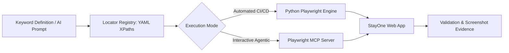

# Playwright MCP Integration Guide for StayOne

This guide explains how **Playwright** and the **Playwright Model Context Protocol (MCP)** validate StayOne platform keywords using externalized YAML XPath locators.

---

## 1. Overview of Validation Architecture

The framework supports two modes of Playwright validation:

1. **Native Python Playwright Engine** (Default):
   - Fast, headless/headed browser execution via `playwright.sync_api`.
   - Executes keywords defined in [`tests/keywords/keywords.py`](file:///d:/stayone/tests/keywords/keywords.py).
   - Resolves XPaths dynamically from [`tests/locators/*.yaml`](file:///d:/stayone/tests/locators/).
   - Captures full-page screenshots on failure automatically.

2. **Playwright MCP Server** (Agentic / Interactive Mode):
   - Connects an MCP-compatible client (such as Claude Desktop, Cursor, or Antigravity) to a live browser session.
   - Allows AI models and agents to execute tool calls (`playwright_navigate`, `playwright_click`, `playwright_fill`, `playwright_screenshot`) using the exact same YAML XPath locators.



---

## 2. Configuring Playwright MCP Server

To attach a Playwright MCP server to your environment, use `@modelcontextprotocol/server-playwright`.

### Configuration in MCP Client Settings (`claude_desktop_config.json` or MCP settings):

```json
{
  "mcpServers": {
    "playwright": {
      "command": "npx",
      "args": ["-y", "@modelcontextprotocol/server-playwright"]
    }
  }
}
```

### Available MCP Tools for Keywords

| Keyword Action | Equivalent Playwright MCP Tool | Argument Mapping |
| :--- | :--- | :--- |
| `open_admin_login()` | `playwright_navigate` | `{"url": "http://localhost:3000/stayoneadmin"}` |
| `click_xpath(locator_key)` | `playwright_click` | `{"selector": "<xpath_from_yaml>"}` |
| `fill_xpath(locator_key, text)` | `playwright_fill` | `{"selector": "<xpath_from_yaml>", "value": "<text>"}` |
| `verify_visible(locator_key)` | `playwright_evaluate` | `{"script": "document.evaluate(...).singleNodeValue !== null"}` |
| `take_screenshot(name)` | `playwright_screenshot` | `{"name": "<name>"}` |

---

## 3. Running Automated Keyword Validations

To run the full keyword test suite:

```powershell
# Run the keyword-driven test suite
pytest tests/test_keywords_suite.py -v

# Run with visible headed browser:
pytest tests/test_keywords_suite.py -v --headed
```

All failure evidence, screenshots, and logs are automatically archived in [`tests/reports/`](file:///d:/stayone/tests/reports/).
